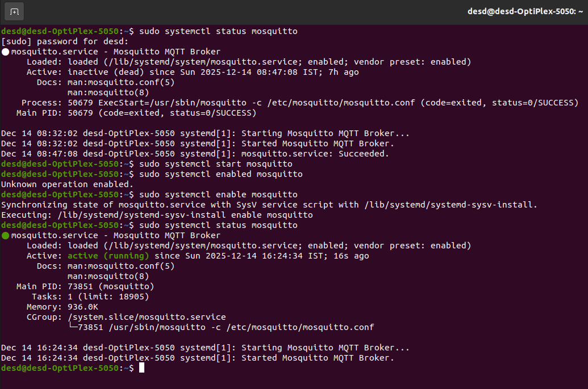
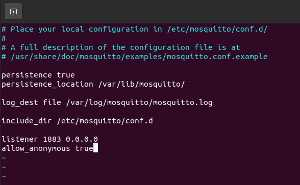
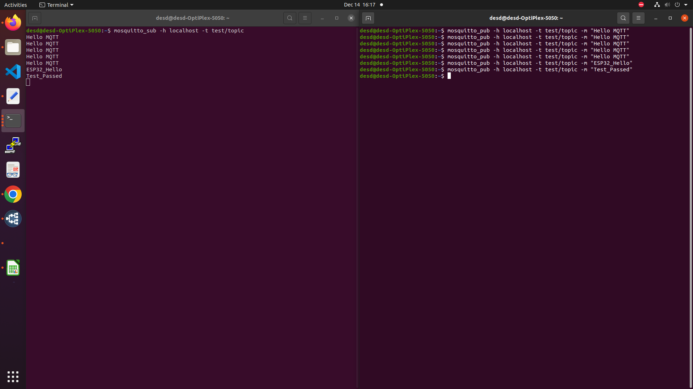
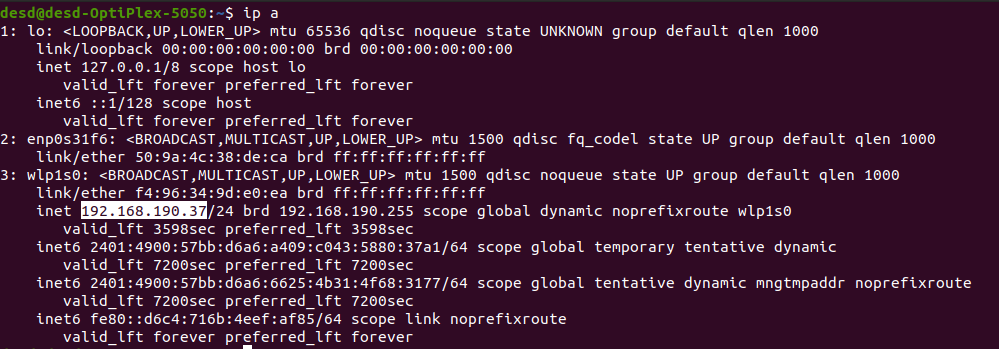
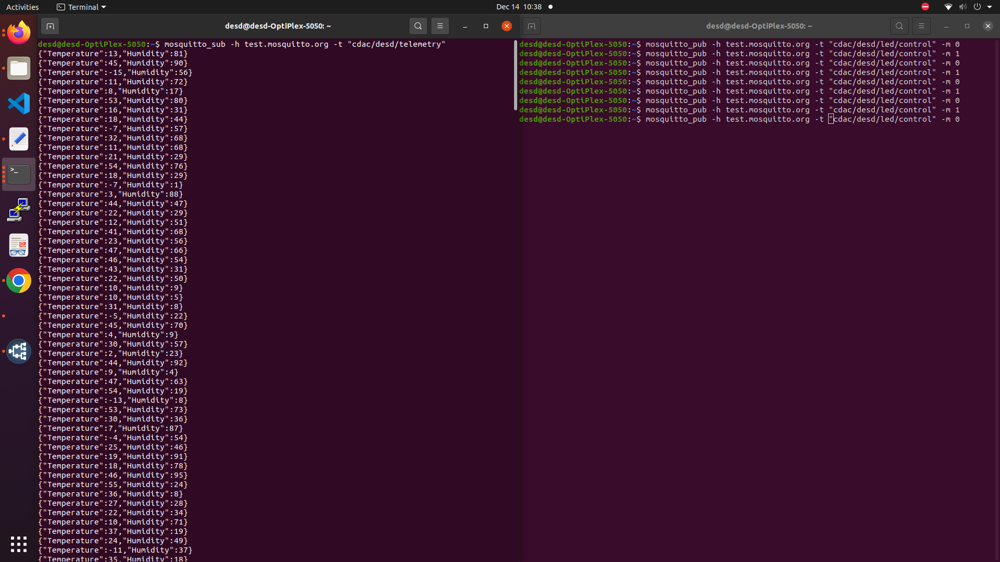
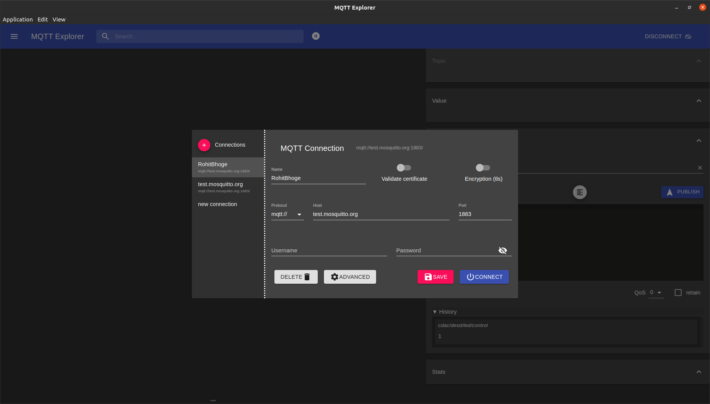

## 🛠️ System Architecture

The ESP32 publishes data to the Mosquitto Broker, which can then be subscribed to by any MQTT client (such as a terminal client).

| Component | Role | Platform |
| :--- | :--- | :--- |
| **ESP32** | Publisher (sends data) | Embedded System |
| **Mosquitto Broker** | Message Hub | Ubuntu PC |
| **Client** | Subscriber (receives data) | Ubuntu Terminal |

-----

## ⚙️ Requirements

### Hardware

  * Common Wi-Fi network for both ESP32 and PC `RECCOMMENDED: MOBILE HOTSPOT`

### Software

  * MQTT Explorer
-----
## 🚀 Setup Steps

> **There are 2 ways to achive the desired results 1st is via making your PC as broker or 2nd via using MQTT Explorer Application**

### **Method 1: Using PC as Mosquitto Broker**

This method requires your Ubuntu PC to host the MQTT Broker service.

```bash
# Update system
sudo apt update 
sudo apt upgrade

# Install Mosquitto broker and client tools
sudo apt install mosquitto mosquitto-clients
```

Verify the installation by checking the version:

```bash
sudo systemctl status mosquitto
```

### Step 2: Start & Enable Mosquitto Service

Start the Mosquitto broker and enable it to start automatically at boot:

```bash
# Start broker
sudo systemctl start mosquitto

# Enable at boot
sudo systemctl enable mosquitto
```

Check the service status:

```bash
sudo systemctl status mosquitto
```

### Step 3: Configure Mosquitto for Network Access


Edit the configuration file to allow network connections:

```bash
sudo nano /etc/mosquitto/mosquitto.conf
```

Add the following lines to the file:

```conf
listener 1883 0.0.0.0
allow_anonymous true
```

Restart the broker to apply the changes:

```bash
sudo systemctl restart mosquitto
```

### Step 4: Test Broker Locally

Open three separate terminal windows on your Ubuntu PC:

1. **mosquitto MQTT Broker Terminal:** Check for verbose logs and flow of events
    ```bash
    mosquitto -v
    ```
2.  **Subscriber Terminal:** Listen for messages on `test/topic`:
    ```bash
    mosquitto_sub -h localhost -t test/topic
    ```
3.  **Publisher Terminal:** Send a test message:
    ```bash
    mosquitto_pub -h localhost -t test/topic -m "Hello MQTT"
    ```

If the message "Hello MQTT" appears in the subscriber terminal, the broker is working correctly.

### Step 5: Find Ubuntu PC IP Address

Find the local IP address of your Ubuntu PC, which the ESP32 will use as the MQTT broker address:

```bash
ip a
```

> **Example:** Look for the IP address under the `inet` field (e.g., `inet 192.168.1.10`). This IP will be used as the MQTT broker address in the ESP32 code.

### Step 6: ESP32 MQTT Publisher Code

Use the following base code, replacing the placeholder values (`YOUR_WIFI_SSID`, `YOUR_WIFI_PASSWORD`, and `192.168.1.10`) with your actual Wi-Fi credentials and the Ubuntu PC's IP address (broker).
> Common Brokers: `"broker.hivemq.com";` `"test.mosquitto.org";` if these brokers doesn't work retrive your IP from `ip a` command and paste it into your esp32 code in broker section.

> [Link To Main File](code/mqqt_esp32_basic.ino)
>  | [Link To Config File](code/config.h)

```
Update Config.h file:
       const char *ssid = "YOUR_WIFI_SSID";
       const char *password = "YOUR_WIFI_PASSWORD";
       const char *MQTT_BROKER = "192.168.1.10";
       const char *MQTT_CLIENT_ID = "nodeESP32";
```
### Step 7: Verify ESP32 → Ubuntu Communication

Compile and upload the code to your ESP32.

On the Ubuntu PC, open a terminal and subscribe to the topic the ESP32 is publishing to:

```bash
mosquitto_sub -h 192.168.1.10 -t "cdac/desd/telemetry"
```

You should see the message being received:

```
{"Temperature":45,"Humidity":82}
```

Open another terminal and publish to the topic the ESP32 is subscribing to:
```bash
mosquitto_pub -h 192.168.1.10 -t "cdac/desd/led/control" -m 1
```

You should see the message being received on ESP32 and the On-Board LED should turn ON:
```
Message arrived [cdac/desd/led/control]: 1
```
-----

### **Method 2: Using MQTT Explorer Application**

This method is recommended for easy monitoring, publishing, and debugging.

### Step 1: Install MQTT Explorer

Install the application via the Snap store using the command below:

```bash
sudo snap install mqtt-explorer
```

### Step 2: Configure & Connect


1.  Open MQTT Explorer.
2.  Click **"New Connection"**.
3.  **Name:** `Ubuntu Broker` (or similar)
4.  **Host:** Enter your Ubuntu PC's IP address (e.g., `192.168.1.10`).
      * *Alternatively*, use a public broker like `broker.hivemq.com`.
      * *Make sure the same broker is specified in esp32 code as well.*
5.  **Port:** `1883`
6.  Click **Advanced**.   
    `In topic provide your topic paths (e.g cdac/desd/telemetery)`
    * Enter unique clientID.
8.  Click **"Connect"**.

### Step 3: Monitor & Publish

1.  After the ESP32 is running, you will see the `cdac/desd/telemetry` topic appear in the left pane of MQTT Explorer, along with the received JSON data.
2.  To send a control command, select the **Publish** pane at the bottom.
3.  Enter the topic: `cdac/desd/led/control`
4.  Enter the payload: `1` (to turn the LED ON) or `0` (to turn it OFF).
5.  Click **"Publish"**. The ESP32 should respond to the command.

-----


## 🐛 Debug & Monitoring

| Issue | Cause | Solution |
| :--- | :--- | :--- |
| **ESP32 not connecting** | Wrong broker IP | Use the Ubuntu Broker IP, not `localhost` |
| **Connection refused** | Broker not listening | Check the Mosquitto configuration for `listener 1883` |
| **No messages received** | Topic mismatch | Topics must match exactly (e.g., `esp32/data`) |
| **Frequent disconnects** | Weak Wi-Fi | Improve the Wi-Fi signal or increase the connection delay |
| **mosquitto not listening** | PORT already occupied | check which application is blocking PORT using `sudo lsof -i:1883` then kill the process blocking port using `sudo kill -9 <PID>` |

### Mosquitto Logs

View real-time Mosquitto service logs for deep debugging:

```bash
journalctl -u mosquitto -f
```
